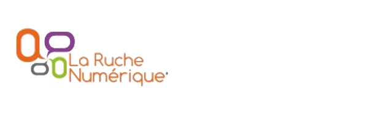

:data-transition-duration: 1500
:css: css/coworking.css

----

:id: title

Coworking Over IP
=================

Outils et astuces over IP pour le travail collaboratif
------------------------------------------------------

----

Avant de commencer
==================

- Qu'est ce que le **HAUM** ?
- Qu'est ce que la **Ruche Numérique** ?
- *TrollTime* Propriétaire ou libre ?

----

Le HAUM
=======

- Hackerspace de l'Université du Maine
- association de passionné(é)s de *hacking* et d'expérimentations
- par extension, association de technophiles :)
- Site Web : http://haum.org
- Twitter : *@haum72*
- Mailing-list : http://lists.matael.org/mailman/listinfo/haum_hackerspace
- IRC : *#haum@irc.freenode.org*

----

La Ruche Numérique
==================

*TODO*

----

Propriétaire ou Libre ?
=======================

::

    <troll></troll>

----

:data-y: r-1000

Constat
=======

- augmentation du nombre de télétravailleurs
- important besoin de communication avec le reste du monde
- insuffisance des outils standards
- besoin de travailler en même temps sur un même produit...

----

Il existe alors une pléthore d'outils...
========================================

----

:data-rotate-z: 90
:data-scale: 0.75

Depuis des outils très... *old school*...
=========================================

- téléphone
- lettre (oui oui...)
- rencontre IRL (in real life)

----

:data-y: r-1600

Avec leurs avantages
--------------------

- bien connus et maitrisés
- bullet proof
- canaux priviligiés desservant (presque) tout le monde

----

:data-rotate-x: 180
:data-y: r-1600

Et leurs inconvénients.
-----------------------

- pas toujours adaptés à la réalité actuelle
- ne permettent pas (ou peu) le travail collaboratif
- peuvent engendrer des frais (lettres recommandées, etc...)

----

:data-rotate-x: r-180
:data-y: r3200
:data-x: r-700

... à du standard online....
============================

- email
- Skype
- Twitter/Facebook

----

:data-y: r-1200

Avec leur bilan
---------------

- bien connus aussi mais souvent mal maîtrisés
- permettent l’envoi à plusieurs
- robustes et plus ou moins éprouvés

----

:data-y: r1200
:data-x: r-700

... voire de l’inconnu
======================

- AdobeConnect (salle de réunion over IP), propriétaire
- Mumble : alternative libre de chat vocal par salon

----

:data-y: r-1200

Avis
----

- méconnus mais puissants
- flexibles et peu couteux
- ...

----

:data-y: r1200
:data-x: r-700

A propos du mail
================

- Créé par la RFC822 en 1982
- joue le rôle électronique de La Poste physique ... avec tous ses travers.

La poste est un intermédiaire de confiance, le mail aussi, mais on ne le connait pas ni ne pouvons le contrôler.

----

:data-x: r-700

Vigilance Constante !!
----------------------

Il est important de :

- Signer ses messages (via PGP/GPG par exemple)
- Chiffrer les données sensibles
- Rester loin des CGU obscures et dangereuses de certains fournisseurs (Google,...)

----

Enfin, il existe des outils moins courants...
=============================================

... mais tellement utiles !

----

Pourquoi ces nouveaux outils ?
==============================

- Pour répondre à des besoins précis
- Pour adapter au mieux les outils à son travail et non l’inverse
- Pour rester réactif et efficace

Quatre exemples pour quatre jeux besoins.

----

Exemple 1 : Besoins
===================

- rédiger en commun des documents
- brainstorming

----

:data-y: r-1200

Exemple 1: EtherPad(Lite)
=========================

- dispo dans de nombreux points du web (Framasoft, divers
- Partis Pirates, autres, ...)
- permet l’export, la création "d’équipes", etc...
- Attention charge maxi variable selon fournisseur
- simple à installer sur son propre serveur

Implémentations existantes
--------------------------

- Etherpad : Java (obsolète)
- EtherpadLite : Node.js

----

:data-y: r1200
:data-x: r-700

Exemple 2: Besoins
==================

- rédiger des documents avec une bonne mise en page ou des slides
- utiliser LaTeX en collaboration

----

:data-y: r1200

Exemple 2 : WriteLATEX
======================

- une sorte d’Etherpad adapté à LaTeX avec auto-régénération du résultat et modifications partagées
- testé et plus qu’approuvé

----

:data-y: r-1200
:data-x: r-700

Exemple 3 : Besoins
===================

- rédaction de gros documents en collaboratif
- code communautaire
- gestion de projet
- gestion de liste de tâches et attribution

----

:data-y: r-1200

Exemple 3: Serveur Git!
=======================

- Github : payant pour un compte privé
- BitBucket : compte privés/publics gratuit
- Gitolite sur un serveur perso

Possibilités
------------

- un suivi des modifications
- gestion des tickets
- attribution des tâches

----

:data-y: r-1200

Gestion de projet pure ?
========================

- Redmine
- Indefero
- Trac
- PivotalTracker (privé, payant)

Autres infos
------------

- Github a une appli Android et des clients Windows et Mac
- Tortoise-git est une appli git pour Windows

----

:data-y: r2400
:data-x: r-700

Exemple 4 : Besoins
===================

- partage de fichiers sur plusieurs machines avec plusieurs personnes
- agenda commun
- serveur perso
- data-parano :)

----

:data-y: r1200

Exemple 4 : OwnCloud
====================

- enfin un cloud libre et privé
- supporté par une vraie communauté
- utilisation sur serveur communautaire ou personnel

----

:data-rotate-z: r-90
:id: arnaques

Gare Aux Arnaques
=================

**Avant de choisir définitivement un service, pensez à lire les CGU.**

Des sites peuvent aider :

http://tosdr.org/

----

:data-x: r-1200

Dropbox
=======

Dropbox et compagnie gardent souvent des droits sur les contenus
déposés.

Elles restent malheureusement très utilisées par certaines
entreprises....

----

Google
======

Connu pour ses pratiques douteuses (suppression de compte sans
préavis).

----

Apple iCloud
============

C’est globalement une mauvaise idée : Apple Inc se réserve un
contrôle total des données déposées

----

Mega
====

Tout nouveau sur le marché, Mega est intéressant, attention à
l’article 8 des CGU...

    8. Our service may automatically delete a piece of data you upload or
    give someone else access to where it determines that that data is an
    exact duplicate of original data already on our service. In that case, you
    will access that original data.

----

:data-rotate-x: 180

Remerciements
=============

- La Ruche Numérique et la CCI
- LinuXMaine
- Le HAUM
- Les relecteurs de ces slides et du plan

A VOUS bien sûr :

----

**THE END**
===========
